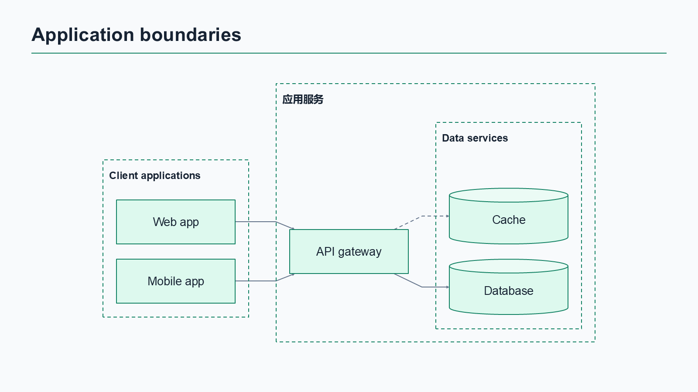
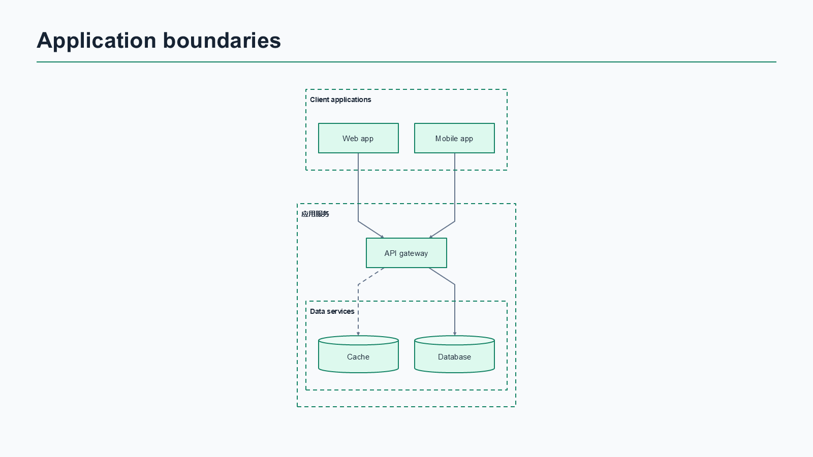
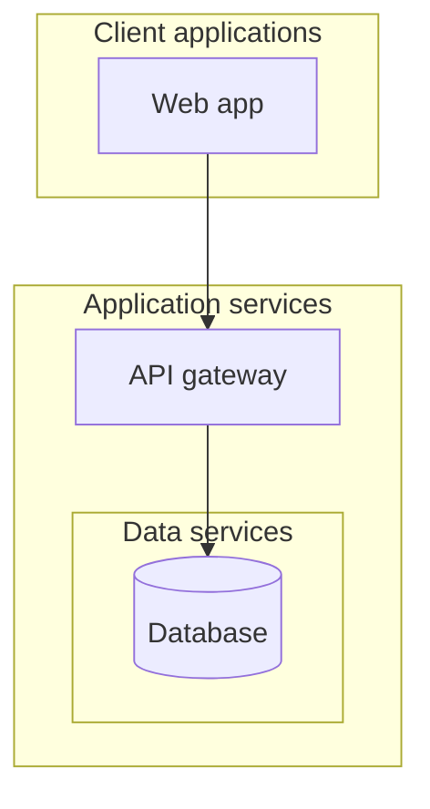
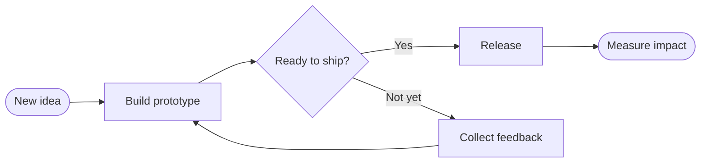

# Mermaid to Slides

**Paste a Mermaid flowchart. Download editable PowerPoint shapes.**

[Live demo](https://freesakura.github.io/mermaid-to-slides/) · [中文说明](README.zh-CN.md) · [Download example PPTX](examples/product.pptx) · [Report a bug](https://github.com/FreeSakura/mermaid-to-slides/issues/new?template=bug_report.yml)


AI tools are good at writing Mermaid. Your teammates still need to change the diagram in a slide deck. Mermaid to Slides turns a focused subset of Mermaid into native PowerPoint objects: editable text inside shapes, editable vector paths, and separate edge labels.

## Try it

1. Open the **[live editor](https://freesakura.github.io/mermaid-to-slides/)**.
2. Paste a flowchart, or choose one of the four examples.
3. Pick a theme and download the `.pptx`.
4. Open it in PowerPoint. Click a node to edit its text or formatting. Use **Edit Points** to adjust a connection.

No account, API key or diagram upload. Parsing, layout and export run in your browser. The site serves application assets normally; it contains no analytics, diagram API or remote fonts.

## Keep working later (v0.2.0)

- **Open file** imports `.mmd` / `.mermaid` source or a Mermaid to Slides project JSON. Importing source preserves the current title and theme.
- **Save .mmd** downloads exact source text, including unfinished diagrams.
- **Save project** downloads a versioned `.mts.json` file containing source, slide title and theme. Open it in another browser or device to continue.
- **Remember draft on this device** enables local autosave and restores your latest work after reload. This is off by default. **Clear saved draft** removes the saved copy and switches storage off, while leaving the editor unchanged.
- **Undo replace** restores the previous editor state after opening a file or selecting an example.

Local drafts stay in that browser and site origin, are visible to others using the same browser profile, and may disappear when browser data is cleared. They are not cross-device sync. Export a project file for a durable backup. If storage is blocked or full, the editor stays usable and reports the saving problem. File imports are limited to 256 KB and the existing source-size limit still applies.

[Changelog](CHANGELOG.md) · [Research and iteration policy](docs/ITERATION_POLICY.md)

## Fit diagrams to a slide (v0.4.0)



Click **Fit to slide** to compare global directions using compact spacing. Or choose a slide direction and comfortable/compact spacing yourself. **From source** with **Comfortable** remains the default and preserves the original output.

Best fit compares four directions for the chosen spacing and chooses the largest nominal node-label size, preferring the source direction on ties. The grouped example changes from **9.22 pt to 16.00 pt**; reproduce the comparison with `node scripts/readability-report.mjs`. This is a bounded layout heuristic, not a readability guarantee or an optimal-layout solver. Group titles and edge labels are smaller than node labels, and PowerPoint font substitution/autofit can affect actual text. Large diagrams may still require shorter labels or separate slides.

The source editor and `.mmd` exports retain the original Mermaid. SVG/PPT export uses the selected presentation layout; source and settings are saved in PPT notes. Use a project file to retain layout settings across devices. New schema-v2 files include `layout.direction` and `layout.spacing`; existing v1 files/drafts are accepted with source/comfortable defaults. Older app releases may reject v2 files.

[Try the saved fitted project](examples/grouped-fit.mts.json) · [Download its PPTX](examples/grouped-fit.pptx). Generate these files with `node scripts/generate-layout-examples.mjs`.

## Group architecture diagrams (v0.3.0)



[Download the grouped example](examples/grouped.pptx), or choose **Grouped architecture** in the editor.



Use `subgraph id [Title]` or a bare identifier (`subgraph services`), closed by `end`. Titles can contain Chinese or quoted plain text. Up to 15 groups and four nesting levels are supported; all inherit the global direction. Declare nodes inside their intended groups before referring to them across boundaries. References to already grouped nodes retain their membership; conflicting declarations are rejected.

PPTX frames and titles are editable native rectangles, **not Office object groups**. Moving a frame does not move its contents. Local `direction`, edges to a whole group, empty groups and collapsible-group metadata are not supported; connect to a named node inside the group instead.

## What you get

- Native PowerPoint nodes with text inside the shape, not a screenshot.
- One editable freeform path per connection, with arrowheads and dashed/thick styles.
- A 16:9 slide, three themes, SVG export and the original source in speaker notes.
- Chinese and English label wrapping, plus a warning when a diagram becomes too dense.
- Clear errors for unsupported syntax rather than silently missing diagram content.

**Connections do not automatically reroute when a node moves.** Edit their points manually. Edge labels are separate text objects. The preview and PowerPoint share geometry, but font rendering can vary by operating system and presentation application. Chinese text uses Microsoft YaHei when available, with application font substitution otherwise.

## Supported Mermaid subset

This project uses its own deliberately small parser and Dagre layout. It is **not the complete Mermaid renderer** and does not reproduce Mermaid's default styling.



| Feature        | Supported                                                                                     |
| -------------- | --------------------------------------------------------------------------------------------- |
| Diagram header | `flowchart` / `graph`, LR / RL / TB / TD / BT                                                 |
| Nodes          | Rectangle `[ ]`, rounded `( )`, pill `([ ])`, diamond `{ }`, circle `(( ))`, database `[( )]` |
| Edges          | `-->`, `---`, `-.->`, `==>`                                                                   |
| Edge labels    | `A -->\|Yes\| B` or `A -- Yes --> B`                                                          |
| Text           | Plain text, quoted labels, Chinese, `<br/>` line breaks                                       |
| Other          | Chains, repeated node references, `%%` comments, semicolon-separated statements               |
| Limits         | 60 nodes, 100 edges, 30,000 source characters, 240 characters per label                       |

Not supported yet: local subgraph directions, edges to whole groups, collapsed groups, `classDef`, `style`, click actions, HTML/Markdown labels, Mermaid initialization directives, sequence/class/ER diagrams, images or arbitrary SVG import. Split large diagrams into separate slides. SVG export contains the diagram only; PPTX includes the slide title.

## Run locally

Requires Node.js **22.13 or newer**.

```bash
git clone https://github.com/FreeSakura/mermaid-to-slides.git
cd mermaid-to-slides
npm ci
npm run dev
```

```bash
npm run check                  # parser, export, UI-controller tests and production build
node scripts/generate-examples.mjs
npm run preview                # serve the production build locally
```

`npm run build` produces a static `dist/` folder. It works on GitHub Pages and other static hosts, including a repository subpath. No server or environment variables are needed.

## How it works

`Mermaid subset → graph model → Dagre layout → SVG preview / PptxGenJS + OOXML export`

Node text stays inside its PowerPoint shape. Routed edges use a single native freeform shape per edge; they are not embedded images. The export avoids custom geometry in `p:cxnSp`, which PowerPoint rejected during compatibility testing. Source is retained in slide notes for regeneration.

The repository includes parser/geometry regression tests, source escaping checks, native-object export checks and DOM-based controller tests. The four shipped PPTX examples were additionally opened and rendered in Microsoft PowerPoint on Windows. Automated tests are not a guarantee of identical rendering in every slide application; please report the application/version with compatibility issues.

## Contributing

See [CONTRIBUTING.md](CONTRIBUTING.md). Small, well-tested parser improvements and real-world anonymized examples are welcome. When adding syntax, update parsing, preview, PPTX export, tests and the support table together.

If this saves you time, a star helps other people discover it.

## Credits and license

[Dagre](https://github.com/dagrejs/dagre) for graph layout, [PptxGenJS](https://github.com/gitbrent/PptxGenJS) for presentation generation, [JSZip](https://github.com/Stuk/jszip) for package editing, and [Vite](https://github.com/vitejs/vite) for the build. See [THIRD_PARTY_NOTICES.md](THIRD_PARTY_NOTICES.md).

MIT © 2026 FreeSakura. This independent project is not affiliated with Mermaid or Microsoft.
